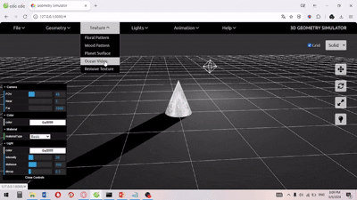

# Geometry Simulator

## Overview
Geometry Simulator is a **3D interactive web application** that allows users to visualize and manipulate geometric objects. It provides an intuitive interface for applying transformations such as translation, rotation, and scaling, making it a useful tool for learning and exploring geometry concepts.


## Features
- **3D Object Rendering**: Uses **Three.js** to render geometric shapes in a dynamic environment.
- **Affine Transformations**: Supports translation, rotation, and scaling with real-time visualization.
- **User Interaction**: Includes interactive controls using **dat.GUI** for parameter adjustments.
- **GLTF Model Support**: Allows users to import/export 3D models.
- **Lighting & Textures**: Enhances realism with lighting effects and texture mapping.
- **Smooth UI**: Designed with **CSS animations** for a seamless experience.

## Technologies Used
- **JavaScript (ES6+)**
- **Three.js** (for 3D rendering)
- **dat.GUI** (for UI controls)
- **GLTFLoader** (for 3D model handling)
- **CSS & HTML** (for styling and layout)

## Project Structure
```
Geometry-Simulator/
│── demo/       # Contains demo video and GIF
│── docs/       # Contains slides and documentation
│── src/        # Source code
│── README.md   # Project documentation
```

## Installation & Setup
### Prerequisites
Ensure you have **Node.js** installed on your system.

### Steps
1. Clone the repository:
   ```bash
   git clone https://github.com/your-username/geometry-simulator.git
   cd geometry-simulator
   ```
2. Install dependencies:
   ```bash
   npm install
   ```
3. Run the development server:
   ```bash
   npm start
   ```
4. Open your browser and navigate to `http://localhost:3000`

## Usage
- Use the **UI controls** to manipulate objects in real time.
- Load custom 3D models using the **Import Model** feature.
- Experiment with different **lighting and textures**.
- Save your work by exporting models.

## Demo


_For a full demo video, check the `demo/` folder._

## Future Improvements
- Implement additional transformation types (shearing, reflections).
- Add support for **multi-object interactions**.
- Improve UI responsiveness for mobile devices.
- Optimize performance for handling complex models.

## Contributing
Contributions are welcome! Feel free to fork the project, submit issues, or make pull requests.

## License
This project is licensed under the MIT License. See the `LICENSE` file for more details.

